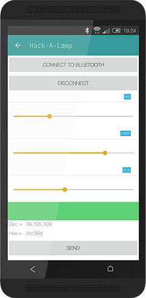

# Hack-A-Lamp

This project can modify RGB LED colour over bluetooth.

Uses [protocoder](http://www.protocoder.org) (by Victor Diaz) and a BQ ZUM BT-328.

Protocoder handles the interface, bluetooth (or BT) communication and colour chosser.

[BQ ZUM BT-328](http://www.bq.com/gb/products/zum.html) handles BT communication and drives RGB LEDs. (it got a BT module integrated on the board and many other great things)

This project started as an idea to hack an ikea lamp and transform it to use with RGB LEDs.

## Usage

Download the project and move .proto file to your smartphone (**recommended**) or tablet.

If your Arduino or Arduino cloned board doesn't have a bluetooth module, you should connect a BT module and handle to recieve data over BT-Serial.

Upload *hack-a-lamp_arduino.ino* file to your Arduino board.

Install protocoder apk on your device and then, with a file explorer, open *projects_Hack-a-lamp.proto* file with protocoder. Then run it on your device.

You **must** first pair your BT board or module to your device with bluetooth settings.

On protocoder interface click on Connect to Bluetooth and choose your board, wait until both BTs are connected and move the sliders, then click on Send to change the colour.
## App Inventor

I've made an app with [Mit App Inventor](http://appinventor.mit.edu/explore/), that have the same functionality as protocoder app, but it have some issues that  You can install the apk provided to use this project on your smartphone. Also you can download *.aia* project inside App Inventor folder and import into your App Inventors project to hack, modify, learn or whatever you want to do with it.

### Issues

The app made with Mit App Inventor takes a long time to send info over bluetooth. 

The app made with Mit App Inventor, sometimes, doesn't send info over bluetooth.
### License

This projects is under CC-BY-SA license.

-><-

### References

[HTC One MockUp by Zohan1980 on devianart](http://zohan1980.deviantart.com/art/Htc-One-Flat-PSD-448852499)

[Protocoder by Victor Diaz](http://www.protocoder.org)

[BQ ZUM BT-328](http://www.bq.com/gb/products/zum.html) 

[Mit App Inventor](http://appinventor.mit.edu/explore/)

